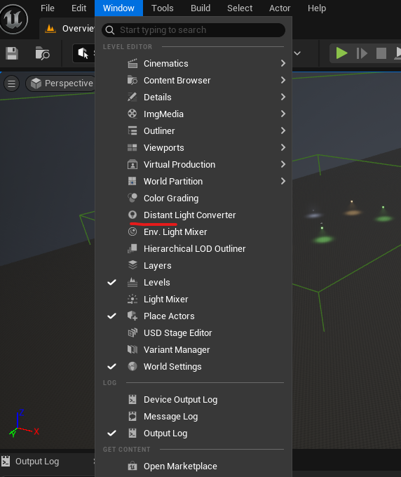
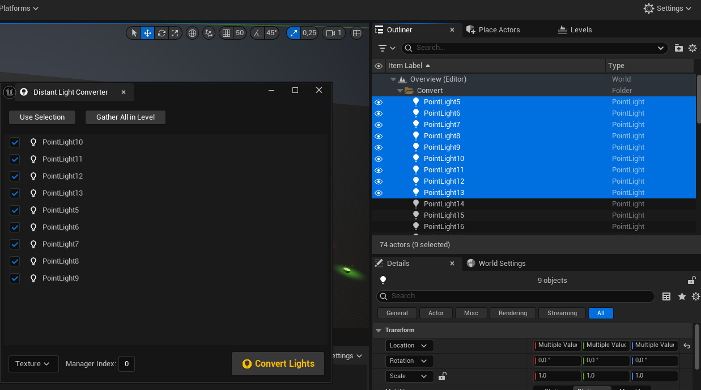

The Distant Light Converter is an editor tool that replaces selected Point and Spot light actors with equivalent Distant Light actors in the current level. It can auto-gather valid lights or select all lights in the level, offering options to override the light type and manager index prior to conversion.

To use this tool, follow the steps below: 

{}

#### Open the Converter

Navigate to the **Window** tab at the top of the editor and find **Distant Light Converter**, as shown in the image below.

#### Select Light Actors

There are two methods to select valid light actors in your level:

1. **Manual Selection:** Select the desired local light actors in the level or in the **Level Outliner** tab. Only valid actors will appear in the converter window. Example below:

2. **Auto Gather:** Press the `Gather All in Level` button, which will find all valid light actors in the level and add them to the converter list.


After pressing `Gather All in Level`, clicking `Use Selection` will revert to the default behavior of auto-gathering only the currently selected actors.


#### (Optional) Specify Parameters

There are two main parameters that can be overridden before conversion:

- **Distant Light Type**
- **Manager Index**

The default type is **Texture**, and the default index is **0**.

#### Finish the Conversion

Press the `Convert Lights` button after all required lights are checked and the correct parameters are set. Wait for the conversion to finish.


Converting many lights may take some time.


{}
