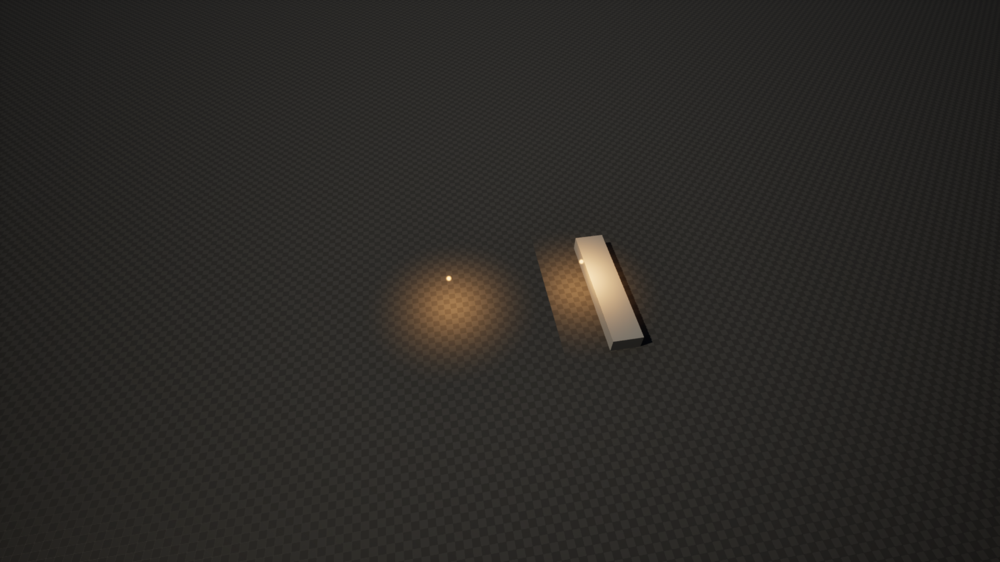
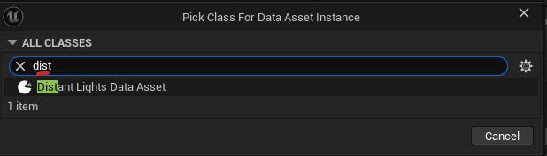
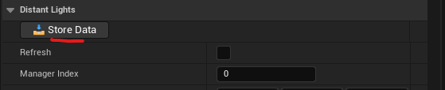
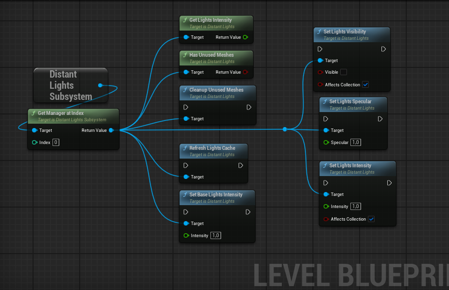
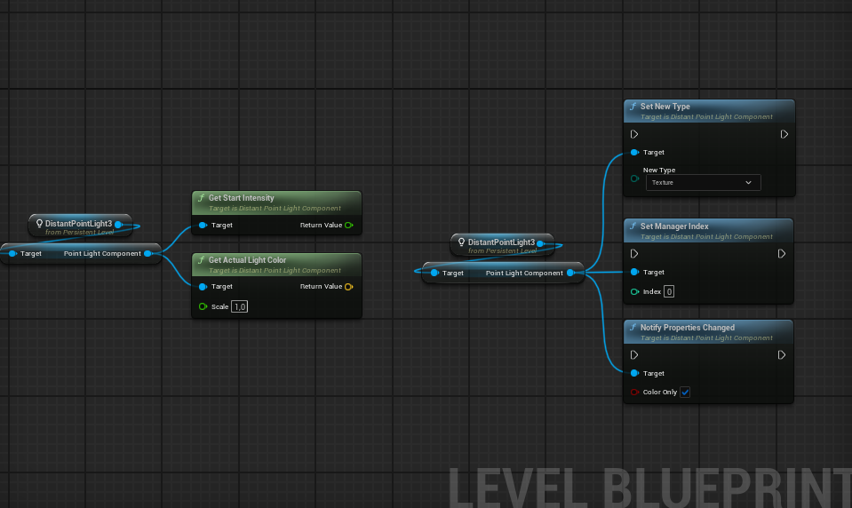
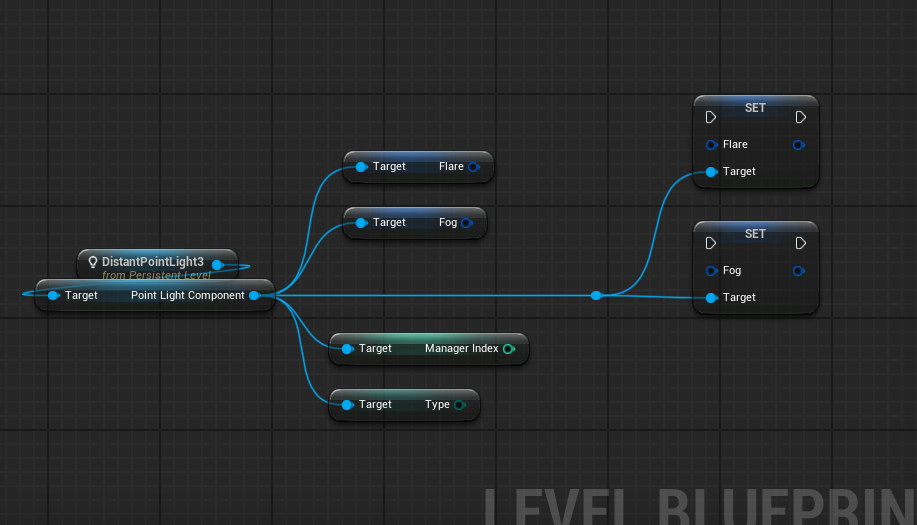
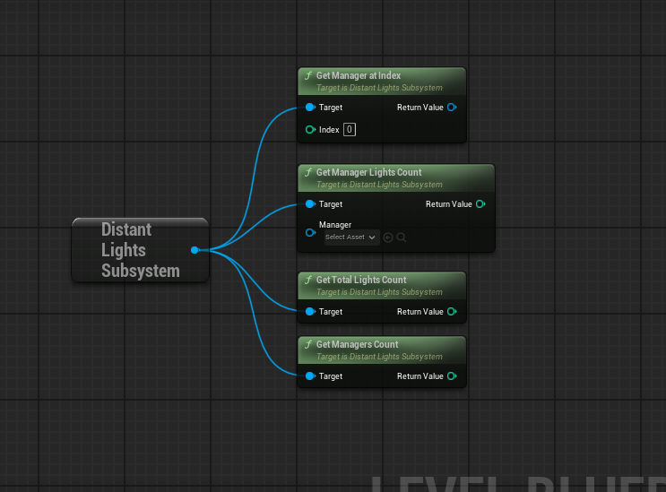

## Distant Lights Manager

The Distant Lights Manager is based on an Actor class and allows multiple managers to be placed in a level. It handles light registration and unregistration, parameter updates, and World Partition transitions. Since Distant Lights may reference almost all lights placed in a level, the manager can act as a controller for dynamic Night/Day systems or Time-of-Day during gameplay. A built-in function is provided for such cases.

The manager processes distant lights in a deferred manner. When data changes during a frame, buffers are updated only after all changes have been collected. While updating render targets can be expensive, this method keeps performance at adequate levels.


Only inverse squared falloff is supported for lights. Simple falloff is technically possible, but it would require additional shader instructions and branches. To keep things simple, only the physically correct version is supported.


---

### Light Types

The manager supports two light types: **Post Process Lights** and **Mesh Lights**. Each has its own pros and cons. Mesh Lights are further split into two subtypes: Mesh and Sprite. The manager can change light types during gameplay.

#### Texture (Post Process, Default)

Draws necessary light data to render targets and uses a unique post process material per manager as a cheap distant light.

**Pros:**
- Good for non-movable lights, or lights that only need to change color-related parameters or visibility.
- Post process material is extremely cheap—only 4 texture samples. Should be used whenever possible.
- No pixel overdraw issues because the post process material is a simple quad with a fixed cost.

**Cons:**
- Texture lights within the same manager cannot overlap, as this produces incorrect results.
  
- Updating transforms or certain light parameters can be expensive, though it is supported.

**Overlap Workarounds:**
1. Use another small, local Distant Lights Manager and place overlapping lights there.
2. Use Mesh Lights (Mesh or Sprite) instead.

---

#### Mesh

Creates an instanced static mesh for each supported light type (Point and Spot) and passes data as *Per Instance Custom Data*.

**Pros:**
- Cheap to update transforms or light properties.
- Not affected by occlusion culling (it's a regular mesh).
- Supports fog.

**Cons:**
- Quad overdraw and shader complexity can be high due to translucent materials.
- Somewhat high vertex count (Point light mesh has ~660 vertices).

---

#### Sprite

Creates a **single** instanced static mesh for all light types and passes data similarly to the Mesh type.

**Pros:**
- Low vertex count (simple quad/plane with 4 vertices).
- May be a good option for mobile projects.

**Cons:**
- Shader complexity and overdraw are higher than with the Mesh type.
- Due to the nature of distant light projection, sprites are not a good option for Spot lights—half of the sprite is likely filled with opacity 0, increasing pixel overdraw.
- Can be occlusion-culled by Unreal Engine's occlusion system.


To counter occlusion culling issues, the manager has a **Sprite Enlargement** parameter. This scales the sprite size on the CPU side, but visually (since the actual size is not used in the material) it stays the same—even though the rendered bounds are larger.


### General Parameters

The **Lights Specular** parameter is not used by default, but it is available if you want to enable specular highlights in distant lights. To enable specular, override the default materials in the manager by creating material instances and enabling `Use Specular` in the parameters.

| Variable | Default | Description |
|:--|:--|:--|
| **Manager Index** | 0 | Unique index of the manager. |
| **Map Size** | 2.0, 2.0, 0.2 | Controls the size of the Box Component and world size. Affects render target resolution. Size is in **kilometers**. |
| **Base Lights Intensity** | 1.0 | Base intensity multiplier for all distant lights. |
| **Post Process Material** | PP_DistantLights | Post process material used for texture lights. |
| **Render Target Scale** | 1.0 | Scale factor for render target resolution. |
| **Mesh Material** | M_DistantLight | Material used for mesh lights. |
| **Sprite Material** | M_DistantLight_Sprite | Material used for sprite lights. |
| **Sprite Enlargement** | 1.0 | Scales the instance size to counter occlusion culling. Does not change the actual visual size of the sprite. |
| **Flares Material** | M_DistantLight_Flare | Default material used for flares, if not overridden in the Distant Light component. |

---

### Advanced Parameters

| Variable | Default | Description |
|:--|:--|:--|
| **Material Collection** | None | Optional material parameter collection. Useful for emissive materials with light components, allowing light intensity to blend into them as well. |
| **Intensity Param Name** | None | Parameter name in the MPC used for intensity control. |
| **Post Process Priority** | 10 | Base priority order for the post process material. The final index is calculated based on the number of managers in the level. |
| **Texture Data** | None | Render target textures. For debugging purposes. |

----

### World Partition

In World Partition levels, Unreal loads and unloads cells based on distance to a streaming source. Because of this, Distant Light Components cannot be relied upon as references, as they may be unloaded at any time.

To address this issue, a specialized **Data Asset** is used. It precomputes all required light parameters in the Editor.


The Data Asset cannot be changed at runtime. It serves as a static fallback version of a light.


At runtime, the manager first processes the precomputed lights from the Data Asset. After that, actual references (pointers) to light components may be obtained. If a light component is not present in the level (because its cell is unloaded), the manager uses the stored static data from the Data Asset.

When a cell is loaded, the manager replaces the static light data with the current parameters of the loaded light component. When a cell is unloaded, the reference to the light is removed, and the light is replaced with its static version.


If the actual light is animated or movable, it may pop in when the cell loads.


---

### Storing Static Lights in the Editor

To store static lights in the Data Asset, follow the steps below.

{}

#### Navigate to Data Asset Creation
In the **Content Browser**, navigate to **Miscellaneous → Data Asset**, as shown below.

#### Create the Data Asset
In the pop-up window, find and select the **Distant Lights Data Asset** class. Press the **Select** button, then enter a name for your custom Data Asset (e.g., `DA_WP_Lights_01`).

#### (Optional) Refresh Lights
Optionally, check the **Refresh** checkbox to ensure the Data Asset reflects the actual current lights in the level. This can help clear any stale or junk data left during editing.

#### Store the Lights
After the Data Asset is assigned and the lights are refreshed, press the `Store Data` button. This will write all lights associated with the manager into the Data Asset.

{}

----

### Blueprint Functions

Below is avaliable function in Distant Lights manager:

`CleanupUnusedMeshes` and `HasUnusedMeshes` may be usefull for dynamic TOD, when lights aren't exactly neccessary, so they can be completely removed from memory. 

`RefreshLightsCache` can be usefull to store current light intensity from distant light components before blending lights. 

`SetBaseLightsIntensity` allows to scale distant lights intensity separately from actual light components. 

`SetLightsIntensity` and `SetLightsVisibility` are two main function which allows to blend lights intensity on distant and light components direcly. Functions can update material parameter collection variable is required, `SetLightsVisibility` function just sets value to 0 or 1 depending on visibility.

---

## Light Components

Distant Spot and Point Light Components are regular lights with additional parameters related to the Distant Lights Manager. A light component relies heavily on two parameters: **Max Draw Distance** and **Max Distance Fade Range**. Both must be specified for distant lights to work correctly.
If these parameters are set to 0, a double light will occur, resulting in increased light intensity at the light's position.


In Standalone game mode, Max Draw Distance and Max Distance Fade Range are calculated differently compared to PIE and packaged builds. As a result, the blending between the distant and actual light components may appear incorrect.


Light component destruction, movement, and visibility are auto-tracked by the manager. You only need to notify the manager about changed parameters. Parameters related to distant lights, Attenuation Radius and Light Units—require notification to the manager. Parameters related to shadows are not taken into account, so no notification is needed.


The EV light unit type can sometimes become negative in the Editor when changing light unit types. Additionally, blending results may be incorrect when using EV units. Therefore, Distant Light Actors force **Candelas** instead of EV. (No idea how a light can have a negative value.)


### Component Functions

The following functions are available in both Point and Spot Light Components:

`GetActualLightColor` outputs the final light color, taking into account Color, Temperature, Intensity, and Diffuse Scale. The result is normalized to a vector because the final value can be enormously large. The Scale factor is a handy multiplier. This function is useful for light meshes where you need to sync the light component with an emissive property in the mesh.

`GetStartIntensity` outputs the stored intensity value from the manager. This value is calculated once the manager registers the light and can be updated using `RefreshLightCache` via subsystem. 

`NotifyPropertiesChanged` is an event for the Distant Lights Manager that triggers when parameters are changed in the light component. This is only valid at **runtime**. Light parameters such as Color, Temperature, Intensity, or Diffuse Scale can use a fast path for updating distant lights (significantly faster for Texture light types).

---

### Component Variables

Below are the available variables in both Point and Spot Light Components:

You can freely use Distant Light Components in Blueprints, add them dynamically in the Construction Script, or spawn them at runtime. Examples can be found in the **Overview** level, inside the Level Blueprint.

**Distant Point and Spot Light Actors** are just wrappers around light components (similar to native Unreal classes) and can be placed directly in the level.

--- 

## Subsystem

The Distant Lights Subsystem is the main bridge between Distant Light Components and the specified manager. It provides useful functions that can help during gameplay. The most valuable is a direct reference to the manager itself.

