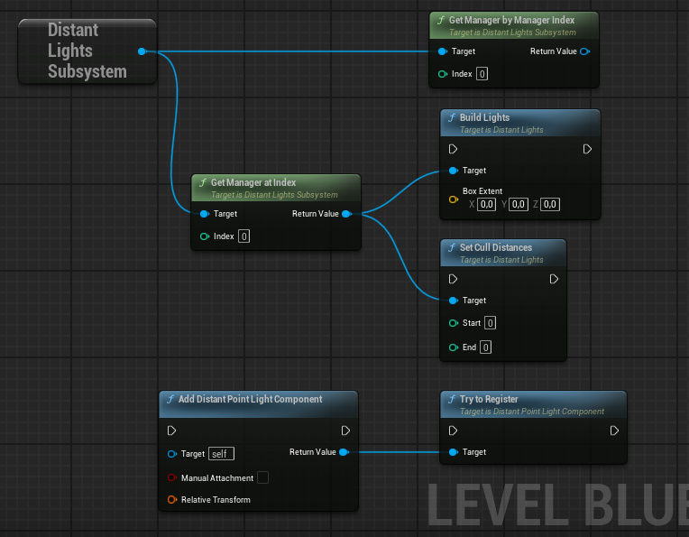

## Version 1.2

**Added**
* `Try To Register` Blueprint function for spot and point light components. This allows you to manually register a light in cases where auto‑registration fails.
- `Allow Texture Lights` variable to the Distant Lights Manager, enabling you to skip texture lights and save memory on post‑process and render target creation.
- `Run On Construction` variable to allow manual light building in Blueprints — useful for fully dynamic scenarios with procedural generation.
* Start and end cull distances variable for mesh/sprite lights. Allows to cap max draw distance on instanced distant lights. 

**Fixed**
- Fixed an issue where new dynamic lights were not properly registered at runtime in some situations.
- Various small non‑critical fixes and cleanup.

**Changed**
- Added separate categories for variables in the Distant Lights Manager.
- Increased the size of the editor actor sprite in the Distant Lights Manager.
- Updated the example project to the latest version of the plugin.

---

## Version 1.1

**Added**
* Specular scale for mesh and sprite lights.

**Fixed**
* Fixed incorrect distance calculation for spot light fade mask.
* Various small non-critical fixes.

**Changed**
* Shortened the distance at which mesh lights and flares collapse vertices, improved performance a bit.
* Switched from Blinn-Phong to approximate GGX specular: cheaper and more native-looking.
* Specular highlights are enabled by default.
* Default Specular value is now 1 and clamped to 1 (matching Unreal).
  
---

## Version 1.02

**Added**
* Added a parameter to control fog intensity for all distant lights in the manager.
* Added Blueprint functions for runtime fog control.

---

## Version 1.0

* Initial realese. 

