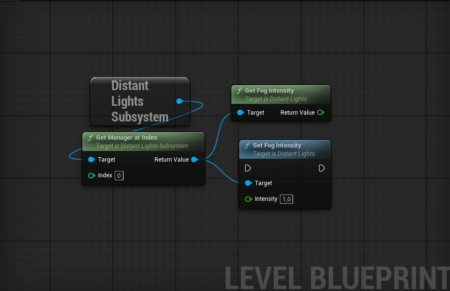

## Version 1.02

**Added**
* Added a parameter to control fog intensity for all distant lights in the manager.
* Added Blueprint functions for runtime fog control.

## Version 1.0

* Initial realese. 

