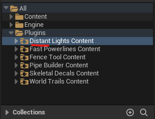
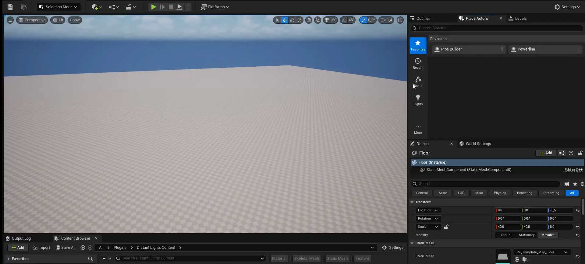
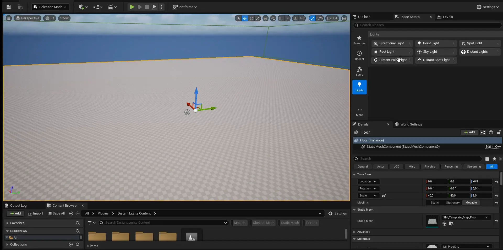

A quick guide to get started with the Powerlines plugin.

## Installing the Plugin

{}

####  Download
Download the plugin from the **Fab** tab in the Epic Games Launcher.

#### Install
Click **Install to engine** and select your installed Unreal Engine version.

#### Open Plugins Window
Open your project, go to **Edit → Plugins**, and find the Distant Lights plugin window.


Type `lights` in search bar.


#### Enable the Plugin
Enable the plugin by checking its box as shown below.

{}

## Quickstart

{}

#### Navigate to the Plugin Folder
Open the Content Browser and navigate to the Powerlines plugin folder.


If the plugin folder is not visible, ensure **Show Plugin Content** is enabled. Click the **Settings** button in the top-right corner of the Content Browser and check this option.



#### Add Distant Lights Actor

Navifate to **Place Actors** tab, select `Lights` category, find `Distant Lights` actor and drag the actor from there into level.

#### Add Distant Point Light 

Select Distant Point Light or Spot Light from the same category in **Place Actors** tab and drag drog the actor inside distant lights box.
Optionally, modufy default paramaters of light.

#### Check Result

Change the camera position and increase distance to distant lights to ensure everything is working. 



Or you can simply press visibility icon of `Distant Lights` manager in **Outliner** tab.


If something gone wrong, you can always press `Refresh` checkbox in Distant Lights manager to regenerate distant lights.


{}