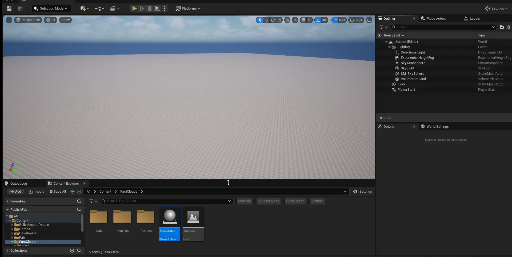
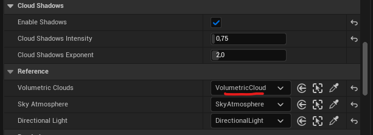
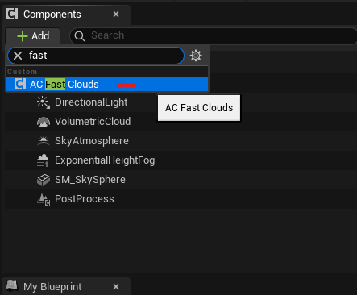
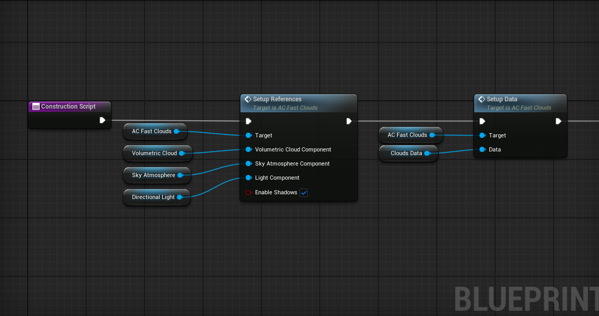
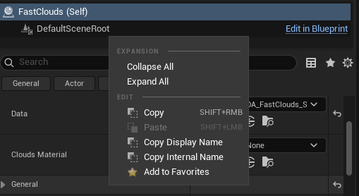
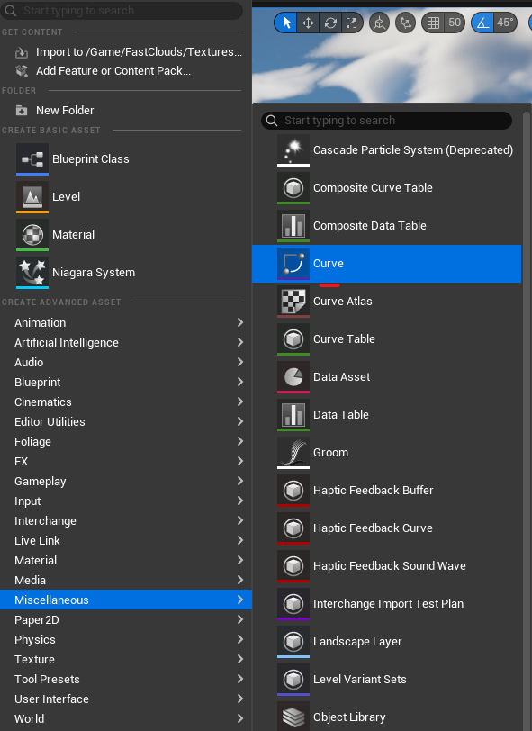
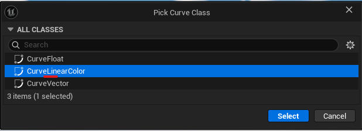
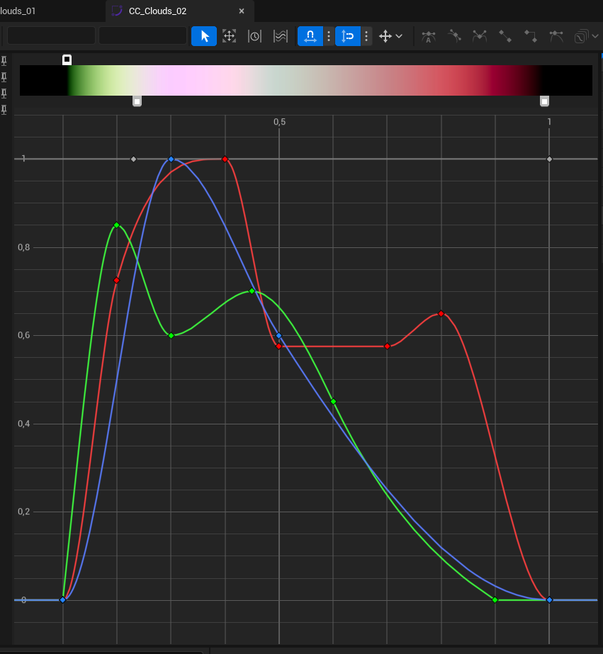
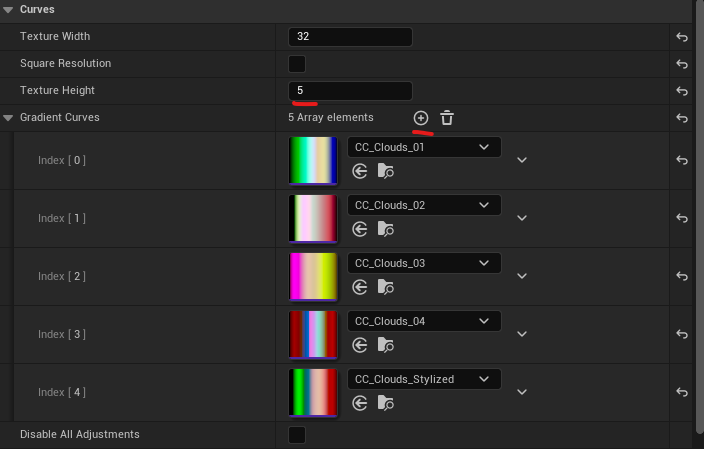









Fast Clouds is a component based data-driven, multi-layered, cloud profiles driven volumetric clouds shader.  It comes with multiple presets and the ability to create your own. Includes proxy cloud shadows based on a directional light function. Each cloud profile is customizble and drived by curves. The package includes pre-baked volume noise textures for optimized runtime performance. 

**Presets included:** 
* Cloudy 
* Partly 
* Wispy 
* Fluffy
* Overcast Dark 
* Overcast Light
* Storm
* Stylized
* Stylized 2

## Quickstart

There are two ways to get started: place the Fast Clouds actor directly in a level, or use it with your own custom sky actor.

### Actor-Based Approach

{}

#### Place Fast Clouds

To see Fast Clouds in action right away, drag the **Fast Clouds** Blueprint actor from the **Content Browser** or the **Place Actors** tab into your scene.

#### Connect Volumetric Clouds 

Scroll down in the Fast Clouds actor, find the **Volumetric Clouds** variable, and select the Volumetric Clouds Actor from your scene.

#### (Optional) Connect Sky Atmosphere & Directional Light

Optionally, you can connect a **Sky Atmosphere** to Fast Clouds, which will change some parameters based on the cloud preset. A reference to the **Directional Light** is necessary for proxy cloud shadows to work. 

#### (Optional) Change Preset 

You can select from number of pre-built presets.





{}

---

### Component-Based Approach

{}

#### Add Component 

Navigate to your custom Sky actor, press the Add button at top-left windon, and find `AC_FastClouds` actor component.

#### Initialize Component

In the Construction Script or Begin Play, add the nodes in the order shown below. Component references should be first for correct behavior.

{}

---

## General

The Fast Clouds actor is a wrapper around the `AC_FastClouds` actor component. The actor can be placed directly in a level or serve as a container for creating a custom cloud preset.

`AC_FastClouds` is an actor component designed for easy integration into a custom sky actor. The component uses a **Preset‑only** approach — it relies on data assets and does not support custom creation.

The actor wrapper, however, features two separate modes: **Custom** and **Preset**. Both modes serve the same purpose but are split to offer flexibility in workflow.

- **Custom Mode** — Available only in the actor. Allows you to create a cloud preset from scratch directly within the actor.
- **Preset Mode** — Available in both the actor and the component. Uses a data asset containing the same parameters, enabling you to quickly switch between different visual presets.


To speed up the creation of a new preset, you can copy struct parameters more quickly.  Right-click the struct parameter (or use the shortcut `Shift+RMB`) to copy the entire struct. Then use `Shift+LMB` to paste the data into a cloud preset.



---

### Wind Direction

**Wind Direction** is a local Fast Clouds parameter. If you want to use your own global wind, there are two strategies:

1. Set wind direction before the Fast Clouds main function in the Construction Script.
2. Use a **Material Parameter Collection**.

Connect your global wind to the **Wind Direction** input pin in the Volumetric Clouds material and the Cloud Shadows light function material, then recompile both.



---

### Main Parameters

| Variable | Default Value | Description |
|----------|---------------|-------------|
| **Profile Row** | 0 | The index or row of the cloud profile. |
| **Density** | 1.0 | General cloud density. |
| **Wind Speed** | 0.5 | Wind speed value. |
| **MultiScatter** | 0.8, 0.5, 0.3 | Multi-scattering values. |
| **Phase** | 0.5, -0.5, 0.25 | Phase function values. |
| **Albedo Color** | White | Clouds albedo color. |
| **Emissive Color** | Black | Emissive color setting. |

---

#### Map 

The Map serves as the foundational 2D layer that defines the overall cloud silhouette. It is also critical for optimization: Unreal Engine leverages conservative density estimation and empty-space skipping, and this 2D layer significantly accelerates ray marching.

The most impactful parameters are `Sharpness` and `Intensity`, which enable the construction of multi-layered clouds. Note that each layer—even with low intensity—adds some performance cost. I recommend using at most 1–2 layers and experimenting with the Sharpness value.

Each vector channel corresponds to a cloud layer, which is mapped to a curve float value to shape the cloud at a specific height.

| Variable | Default Value | Description |
|----------|---------------|-------------|
| **Scale** | 120.0 | Map base scale (in kilometers). |
| **Speed** | 0.5 | Map base speed. |
| **Density** | 1.0 | Map base density. |
| **Texture** | None | Overridable base map texture. |

---

#### Base Noise

Base noise and detail noise share the same structure and act similarly, but each adds another layer of granularity.

| Variable | Default Value | Description |
|----------|---------------|-------------|
| **Scale** | 14.0 | Base noise scale. |
| **Speed** | 40.0 | Base noise speed. |
| **Sharpness** | 0.25 | Base noise sharpness. |
| **Intensity** | 1.0 | Base noise intensity. |

---

#### Detail Noise

| Variable | Default Value | Description |
|----------|---------------|-------------|
| **Scale** | 14.0 | Detail noise scale. |
| **Speed** | 40.0 | Detail noise speed. |
| **Sharpness** | 0.25 | Detail noise sharpness. |
| **Intensity** | 1.0 | Detail noise intensity. |
| **Altitude Offset** | 0.0 | Offsets noise by normalized height in layer. |
| **Altitude Intensity** | 1.0 | Scales the altitude detail mask. |

---

#### Distortion

Distortion affects the base noise and allows for stylized clouds. It is not enabled in the default cloud material and can be quite expensive.

| Variable | Default Value | Description |
|----------|---------------|-------------|
| **Scale** | — | Distortion scale (in kilometers). |
| **Intensity** | — | Distortion intensity. |

---

### Cloud Shadows

Cloud shadows are built from the directional light (if referenced) and are a cheap approximation of volumetric clouds. 

| Variable | Default Value | Description |
|----------|---------------|-------------|
| **Enable Shadows** | false | Enables the proxy cloud shadows |
| **Cloud Shadows Intensity** | 1.0 | Simple multiplier for shadow intensity. |
| **Cloud Shadows Exponent** | 2.0 | Scales shadow strength using an exponent. |

---

### Performance Comparison

Below is a comparison between the default Fast Clouds preset (with extra cloud shadows) and Unreal's native clouds material. The performance of Unreal's clouds material heavily depends on coverage, but generally Fast Clouds is more performant compared to the native material.



---

## Cloud Profiles

Cloud profiles allow you to control the shape of each cloud layer.

To create a custom cloud profile, follow the steps below:

{}

#### Navigate to Curve Creation
In the **Content Browser**, navigate to **Miscellaneous → Curve**, as shown below.

#### Select Curve Class

Select a `Linear Curve` in the new editor window.

#### Modify Curve

The curve should be in the 0–1 range on both axes. Only XYZ or RGB curves are valid; Alpha is not used.

#### Navigate to Curve Atlas

In the **Content Browser**, navigate to the `Data` folder and find `CC_CloudProfiles`.

#### Add Curve to Atlas

In the curve atlas windows, find Texture Height parameter and increase value by 1, it will create additional slot for atlas.
Press plus button in Gradient Curves and assign your custom cloud profile.

{}

