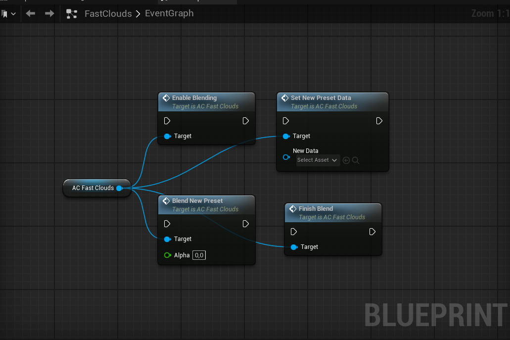

## Version 1.2

**Added**
* Preset blending support.
* Preset blending in the Overview map.
* `Wind Offset`, `bEnableBlending`, and temporary data assets used as temporary variables for blending.
* An additional temporary data asset for blending, located in the `Presets` folder.
* A blending example inside the Fast Clouds actor.
* New functions are shown below.

**Changed**
* Cleaned up the component a bit. 
* Grouped functions and variables in component. 
* Enabled component tick if blending of presets is required. By default tick is still disabled. 
* Set some variables in component to Private. 

**Fixed**
* Access nullptr is Fast Clouds Actor. Non critical, doens't affect anything, but in log there's a warning.  

---

## Version 1.1

**Added**
* A standalone Fast Clouds component.

**Changed**
* All logic moved from the Fast Clouds actor into a component, allowing Fast Clouds to be integrated into any actor with ease.

---

## Version 1.0

* Initial realese. 