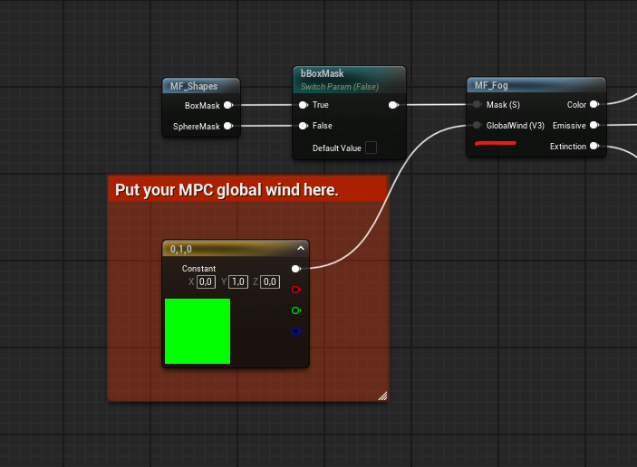
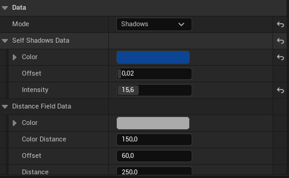
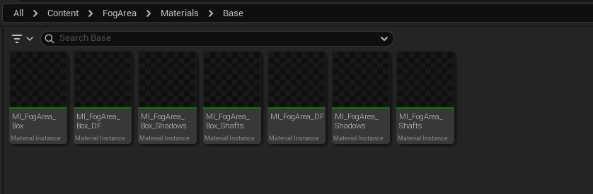
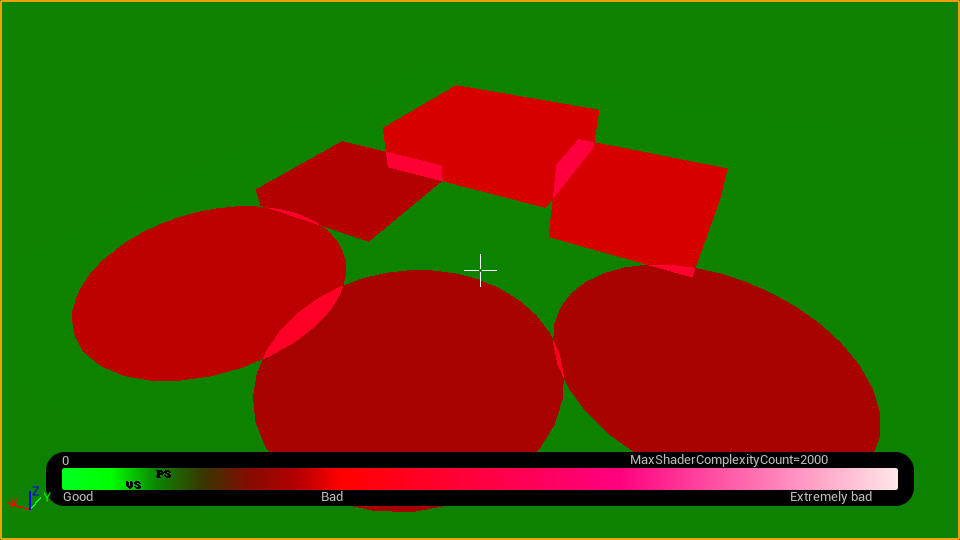
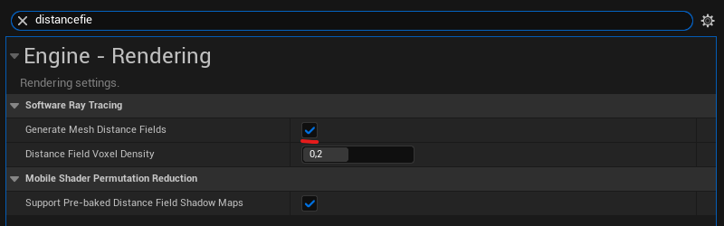









Fog Area is a handy blueprint-based tool designed to add procedural noise-based local fog to your scene. It is easy to use and highly customizable. The package comes with pre-baked noise textures for optimized runtime performance. The core fog shader supports two types of local volumes: sphere and box.

## Quickstart

To get started with a tool and immideatly see local fog in action - Drag and drop fog area blueprint actor from Content Browser, or from the Place Actors tab into your scene. 


If the fog is invisible, make sure that  `Volumetric Fog` is enabled in Exponential fog actor.



## Material Modes

Splitting materials to a dynamic and static allows to increase performance even further by ditching the creation of dynamic material for every fog area actor in scene and use of static material. Almost all properties which are in fog shader are present in a fog area actor. You can create a dynamic fog area is preffered parameters and copy the result to a static version without the need going back and forth to a material editor window. 

| Variable | Default Value | Description |
|----------|---------------|-------------|
| **Box Shape** | false | Toggle between box and sphere shape |
| **Material** | None | Static material reference, if material mode is set to static, but material is nullptr, fallback to dynamic |

## General Data

| Variable | Default Value | Description |
|----------|---------------|-------------|
| **Emissive Color** | N/A | Color emitted by the fog |
| **Base Color** | N/A | Primary color of the fog volume |
| **Density** | 1.0 | Thickness/density of the fog |
| **Mask Margin** | 3.0 | Edge softness/falloff of fog mask, applies to box and sphere |

## Wind

There are 2 options for a wind direction, local and world. Can be switched with a variable `Wind World Space`. 
Local wind is controlled by actor **forward** (X axis) direction. 
Because actor supports static and dynamic materials, passing Global Wind Direction into static material isn't possible (there's a option to pass as custom primitive data, but I don't want to complecate things), so make sure that global wind vector is setup up in Fog shader. 
Put your global wind from Material Parameter Collection to `Global Wind` pin and recompile the shader. 

| Variable | Default Value | Description |
|----------|---------------|-------------|
| **Wind Speed** | 1.0 | Speed of wind movement |

## Noise

| Variable | Default Value | Description |
|----------|---------------|-------------|
| **Channel** | G | Texture channel used for noise sampling |
| **Scale** | 2.5 | Scale multiplier for noise texture |
| **Sharpness** | 0.35 | Controls the softness of noise texture |
| **Noise Texture** | None | Allows to override default Noise volume texture. |
| **Distortion Intensity** | 0.0 | Strength of distortion effect applied to base noise |
| **Distortion Scale** | 4.0 | Scale the sampling size of distortion texture |
| **Distortion Speed** | 0.5 | Control the speed of distortion pan |
| **Distortion Texture** | None | Allows to override default Distortion volume texture |

## Shape Data

| Variable | Default Value | Description |
|----------|---------------|-------------|
| **bUseShape** | false | Toggle shape-based fog |
| **Shape Texture** | None | 2D texture used for fog masking |
| **Channel** | R | Texture channel used for shape sampling |
| **Rotation** | 0.0 | Rotation angle of shape texture |
| **Scale** | 1.0 | Scale multiplier for shape texture |

---

## Advanced

| Variable | Default Value | Description |
|----------|---------------|-------------|
| **Trace Surface** | false | One time event, Trace the surface along negative Z axis, aligns with a hit normal and resets itself to false |
| **Max Draw Distance** | 25000.0 | Maximum distance at which fog mesh is rendered (in world units) |

---

## Modes

Fog area split into 3 modes: Shadows, Distance Field and Light Shafts. 

Under the hood this modes are just regular material instances with preconfigured switches. 
Materials are stored as `Soft` pointers to reduce memory footprint and decrease dependencies from a fog area actor. 

### Performance
The reason why mateiral are split into separate material instances with preconfigured switches is only - performance. 


By splitting material to a separate instances greatly reduces amount of shader instruction and allows to use the same actor without worrying for performance. 
Bellow is an example map in Shader Complexity debug view with different modes on each fog area actor. 

---

### Self Shadows Data

| Variable | Default Value | Description |
|----------|---------------|-------------|
| **Color** | N/A | Color of self-shadowed areas |
| **Offset** | 0.02 | Shadow offset distance |
| **Intensity** | 3.0 | Strength of self-shadow effect |

---

### Distance Field Data

| Variable | Default Value | Description |
|----------|---------------|-------------|
| **Color** | N/A | Distance fields base color  |
| **Color Distance** | 150.0 | Distance threshold for color influence |
| **Offset** | 60.0 | Distance field sampling offset |
| **Distance** | 250.0 | Maximum distance for field influence |


If the distance field mode doesn't change anything, make sure that `Generate Mesh Distance Fields` is enabled in Project Settings.



---

### Shafts Data (Light Shafts)

| Variable | Default Value | Description |
|----------|---------------|-------------|
| **Scale** | 450.0 | Size/scale of light shafts |
| **Sharpness** | 0.0 | Controls the softness/sharpness of light shafts (0 = soft, higher = sharper) |
| **Intensity** | 1.0 | Scales the light shafts texture sample intensity  |
| **Speed** | 0.5 | Animation/movement speed of light shafts |

