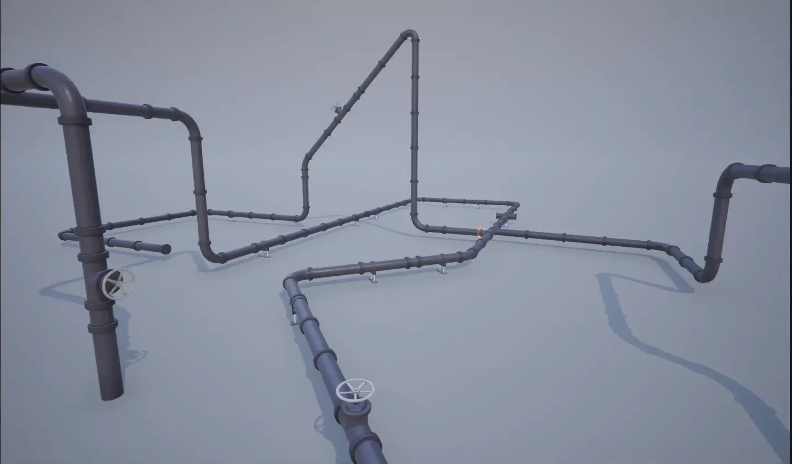



Pipe Builder is an Unreal Engine plugin that enables you to construct detailed pipe networks in minutes using an intuitive spline‑based workflow.

**Key Features:**
* **Data‑Driven Design:** Swap visual styles instantly by changing the data asset—meshes, materials, and settings live separately from the actor.
* **C++ Performance:** Written entirely in C++ for smooth editor interaction, even with hundreds of spline points.
* **Spline‑Based Workflow:** Intuitive point‑and‑drag controls let you sketch complex pipe networks in seconds, not hours.
* **Network Building:** Spawn connected pipes, copy spline points from any actor, and build interconnected systems with junction support.
* **Comprehensive Documentation:** Extensive guides, tips and references.
* **Procedural Variety:** Control mesh selection, roll rotation, and placement through randomization parameters—or override manually for precise results.
* **Dual Corner Systems:** Choose between deformable **Bent** corners for smooth curvature or pre‑modeled **Fitted** corners for high‑performance instancing.
  
---

### Overview

The plugin's structure is divided into two core parts:

1. **Actor**: The spline-based actor placed in levels. Contains all runtime parameters and generation logic.
2. **Data Asset**: Central configuration container storing meshes, material presets, and static parameters. Swapping this asset restyles all connected pipe networks without actor edits. 
   
While many marketplace pipe assets are designed around specific grid sizes (40, 50, or 100 units), this plugin imposes no such constraints. Define the path, assign the meshes, and it scatter geometry along the spline.

---


  
  


