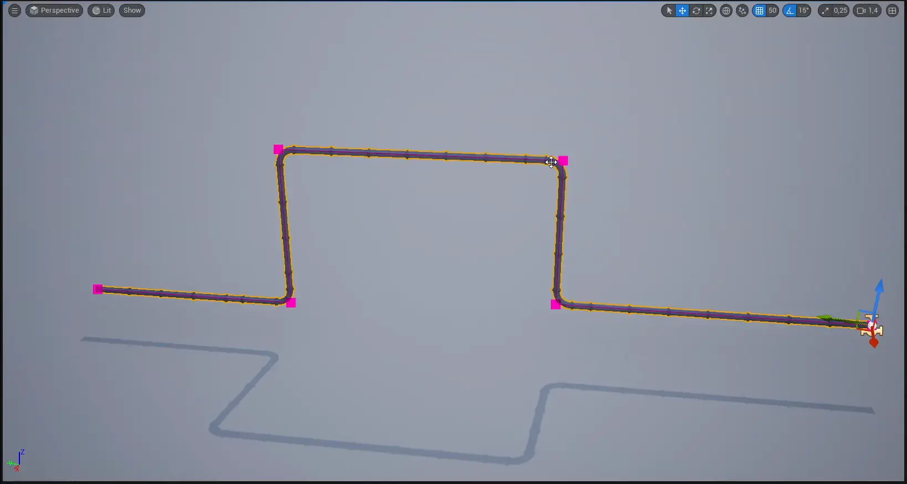
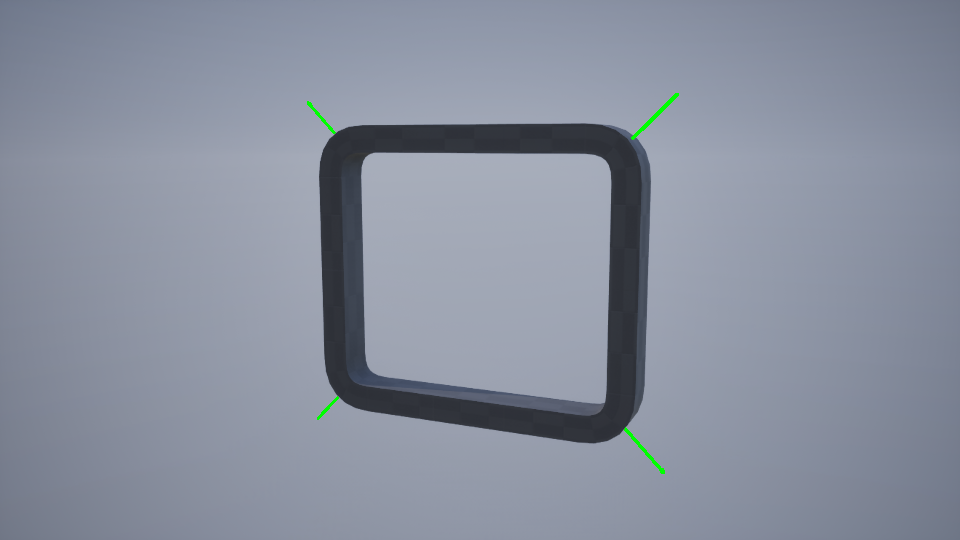

The Pipe Builder actor uses a spline component to generate procedural pipe networks with full control over geometry, corners, junctions, and supports. Built in C++ for responsive editor performance.

## Pipe Variables

| Variable | Default | Description |
|:--|:--|:--|
| **Refresh** | false | Triggers the construction script and resets itself to `false`. Use this to safely update the actor (e.g., modifying connections) without needing to change another variable. |
| **Data Asset** | Pipes Default | The primary data asset containing static meshes, material presets, and all other static configuration data.  |
| **Stream** | Auto-generated | Random seed that controls all procedural variation within the actor, including preset selection, support placement, junctions, etc. |
| **Closed Loop** | false | **Spline Component property.** When enabled, connects the last spline point to the first, forming a continuous loop. Requires at least 3 points. |

--- 

## General Variables

These variables affect nearly all generated meshes.

### Thickness
Controls the overall scale/thickness of pipe meshes. 



### Global Roll Angle
Applies uniform roll rotation to all eligible meshes.




Global roll angle doesn't not apply to `fitted` corner meshes. These pre-modeled corners have fixed orientation requirements that prevent roll rotation while maintaining proper alignment.


---

| Variable | Default | Description |
|:--|:--|:--|
| **Pipe Preset Selection Type** | None | Selection method of material presets.  • **None:** No material preset applied.   • **Random:** Randomly selects a preset and stores the selection as a manual index.  • **Manual:** Enables direct selection via **Pipe Preset Index**|
| **Pipe Preset Index** | -1 | Direct material preset index. Cycles through available presets; `-1` disables selection. |

---

### Loop Mesh Selection 

Controls how segment meshes are chosen along straight pipe segments: Default is `Longest Random` type.

*   **Random:** Selects a random mesh based on weighted probabilities.
*   **Longest:** Identifies the longest available static mesh that fits within the current segment length. 
*   **Longest Random:** PSame as **Longest**, but shuffles the order of selected meshes to create more varied results. This resolves the "shortest mesh last" issue common with the standard **Longest** method. Slightly slower, but produces superior visual variety.



---

### Loop Roll Rotation

Applies randomized rotation to loop segment meshes. 

**Rotation Methods:**
- **None:** No rotation applied.
- **Free:** Random rotation between **Angle Min Max** values.
- **Cardinal:** Snaps rotation to one of four cardinal directions: 0°, 90°, 180°, or 270°.
- **Flip:** Randomly rotates by 180°;

| Variable | Default | Description |
|:--|:--|:--|
| **Angle Min Max** | (0, 360) | Rotation range for **Free** mode. **X** = minimum angle, **Y** = maximum angle (degrees). |

## Corners

The plugin offers two fundamentally different approaches to corner creation, each with distinct advantages and trade-offs.



### Bent Corners
Deforms the spline mesh at each point, with additional control over the bend intensity.

**Advantages:**
- Functions reliably for angles under 90°.
- Produces smooth, continuous curvature.
- No custom static mesh assets required.

**Limitations:**
- UV distortion becomes noticeable beyond 90°.
- Meshes can self-intersect beyond 90°, requiring manual adjustment.
- Spline mesh updates can be slow due to Chaos Physics calculations and high vertex counts.

### Fitted Corners
Places pre-modeled static meshes at spline points, selected based on corner angle and segmentation settings.

**Advantages:**
- Supports instancing and batching.
- Fast to compute—no physics or deformation overhead.
- Handles extreme angles cleanly without distortion.

**Limitations:**
- Cannot be rotated using the global roll angle.
- Requires pivot point setup in an external DCC tool.
- More time-consuming to author and maintain.

---


**Performance Note**  
If you experience freezing while dragging spline points in **Bent** corner mode, the issue is typically slow Chaos Physics updates combined with high vertex count on the deformed mesh.


The plugin mitigates this by deferring spline mesh updates until all required variables are set, but the underlying bottleneck remains.

As shown in the Unreal Insights capture below:



**Recommended Solution:**  
For any deformable corner mesh, manually set **Collision Complexity** to **Use Simple Collision as Complex** in the Static Mesh Editor.  
This can dramatically improves editor responsiveness.
You can revert this setting before packaging if needed.

#### Corner Variables

| Variable | Default | Description |
|:--|:--|:--|
| **Bend Scale** | 1.0 | Global bend multiplier applied to all corner meshes (including manual overrides). Clamped to minimum **0.1**.  |
| **Bend Corner Mesh Selection** | RandomOnce | Determines which static mesh asset will be selected.   • **RandomOnce**: A single mesh is chosen at random and used for all supports.   • **Random**: A mesh is randomly selected per support instance.   • **Manual**: Uses mesh specified by **Mesh Index**. |
| **Manual Bend Data** | Empty | Per-corner overrides for **Manual** bend mode.   Each entry contains:  **Point Index:** Target spline point   **Bend Scale:** Multiplier (clamped to **0.1** minimum)   **Mesh Index:** Cyclical mesh index override   **Note:** Mesh index overrides only apply when **Bend Corner Mesh Selection** is set to **Manual**.|

---

## Junctions

Junctions add branches, caps, or other meshes at spline points, enable connections between pipe actors, and help create a pipe network.

Generation rules:
- **Open splines**: Junctions appear at start and end points
- **Closed splines**: Junctions appear only at the first point
- **Straight segments**: Junctions generate at spline points along a perfectly straight line (no corner mesh)


Tip: For automatic junctions at every spline point, set Junction Selection Mode to `Random`. Once you're done editing the spline, switch to `Manual` mode and customize each junction in the manual array.


### Junction Variables

| Variable | Default | Description |
|:--|:--|:--|
| **Junction Selection Method** | Random | Defines junction selection method.   • **None**: No junctions placed  • **Random**: Randomly selects and populates the manual array.  • **Manual**: Direct specification via **Junctions** list.|
| **Inline Points Only** | true | **Random mode only:**   When enabled, junctions are only added at inline spline points, excluding start and end spline points. |
| **Junction Roll Rotation** | - | Rotation settings for junction meshes (same options as Loop Roll Rotation). |
| **Junction Probability** | 100.0 | Percentage chance (0–100%) of junction generation at valid positions.  |
| **Junctions** | Empty | Complete list of junction placements. Auto-populated in **Random** mode. • **Point Index:** Target spline point • **Mesh Index:** Index in junction meshes list • **Roll Angle:** Manual roll override |


To quickly create an inline junction, select a point, switch the gizmo to local space using Ctrl+`, then hold Alt and drag in your preferred direction. This will create an additional inline point. See the example below.



## Advanced 

| Variable | Default | Description |
|:--|:--|:--|
| **Debug Text Type** | None | **Editor-only**   Adds debug visualization of spline point numbers. Text components aren't packaged, they only exist in-editor. Height and text size is configured in data asset.   **None:** Disable  **Show:** Display text   **Flip Height:** Flip direction offset of height, default is Upward direction or Z axis.|
| **Visualize Corners** | false | **Editor-only**   Draws debug arrows at each corner to visualize angle and orientation for spline mesh correction. |

 

