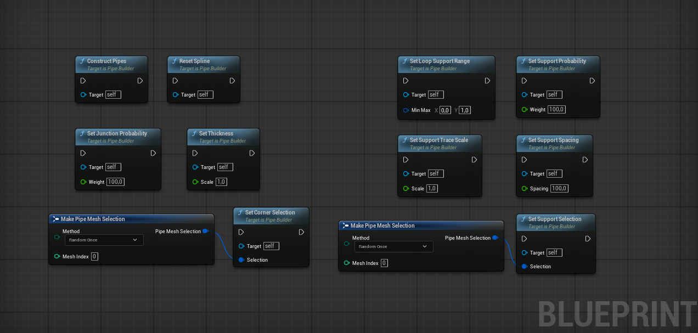
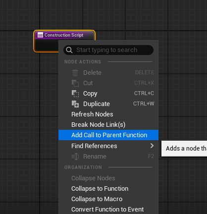
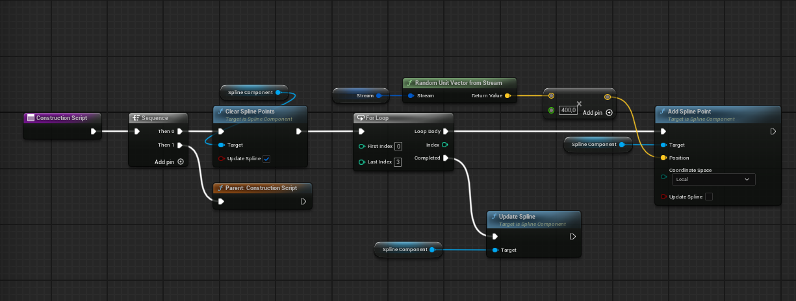
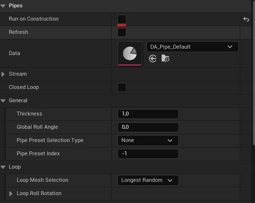
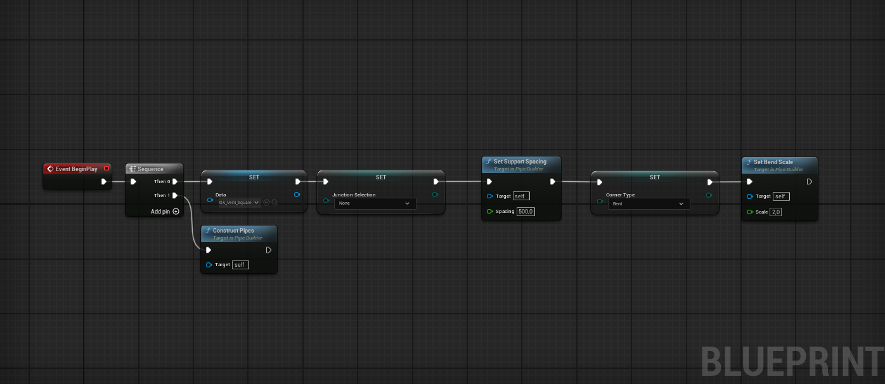

## Functions and variables

Below is a complete list of available parameters and functions. If you find that this list is missing something, feel free to reach out.



---

By default, pipe actors construct themselves during the `Construction Script` phase. However, this behavior can be customized through two primary methods, depending on your specific needs:


Spline points will be automatically converted to `Linear` interpolation type, regardless.


## Enhanced Construction Script

If you need procedural logic but want to maintain editor-time visibility, you can override the Construction Script while preserving core functionality.

{}

### Add a Call to the Parent Function

Navigate to your actor's Construction Script graph, right-click the `ConstructionScript` event node, and select **Add Call to Parent Function**.

### Edit Pre-Construction 

Insert your procedural logic before the parent function call. The example below demonstrates spline points manipulation.

{}

---

## Custom Event

This approach provides maximum control over construction timing and is ideal for procedural levels where build order matters.

{}

### Disable the Construction Script

In your custom actor's Details panel, set the `Run on Construction` boolean property to `false`. Note that this variable can only be changed in the Class Defaults.

### Use a Custom Event

Modify spline points or set any required variables before calling the `ConstructPipe()` function, as shown in the example below.

{}

