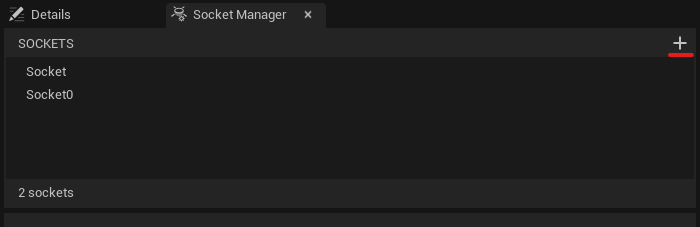
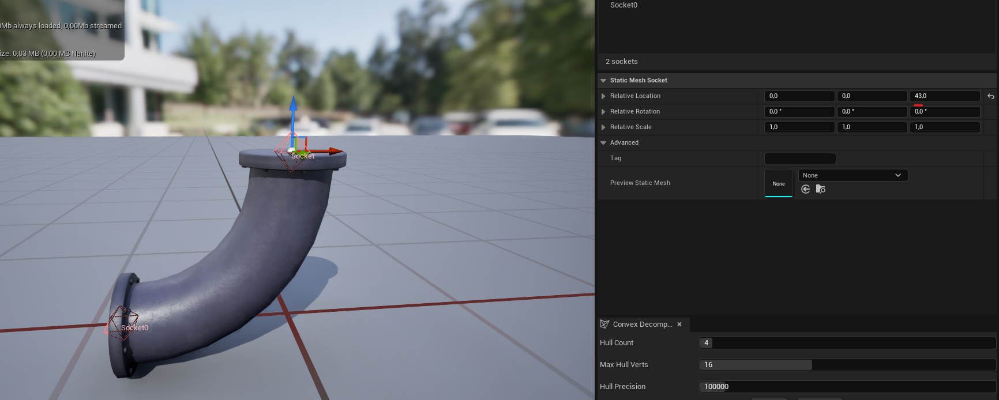
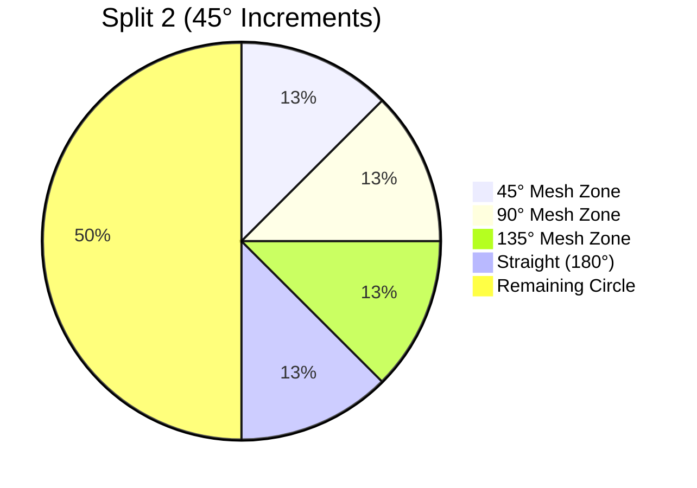
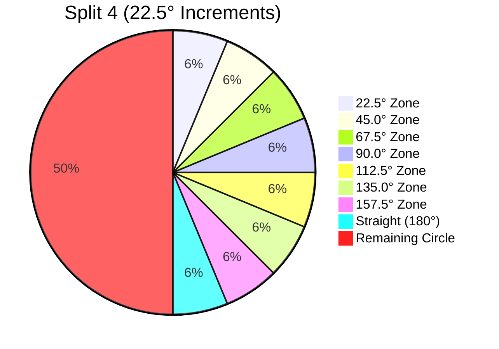
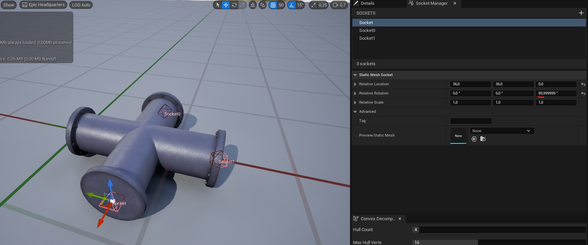

The Pipe Builder Data Asset centralizes all static meshes and parameters that control the Pipe Builder Actor's appearance—loops, corners, junctions, supports, material presets, and component settings. Decoupling this data from the actor enables consistent styling across multiple networks and quick visual iteration through asset swapping, with no actor edits required.

Below is a full list of parameters.

## General Reference

| Variable | Default | Description |
|:--|:--|:--|
| **Pipe Mesh Type** | ISM | Component type used for all pipe meshes. • `StaticMesh` – Simple static mesh component. • `ISM` – Instanced Static Mesh; recommended for `Nanite` assets without LODs. • `HISM` – Hierarchical Instanced Static Mesh; identical to ISM but supports per instance LODs. |
| **Pipe Cull Distance** | (0, 0) | **ISM and HISM only**   X = start, Y = end cull distances. |
| **Pipe Max Draw Distance** | 0.0 | Default maximum draw distance for all pipe meshes. `0.0` = infinite.|
| **Pipe Collision Profile** | – | Default collision profile applied to every mesh component. |
| **Mobility** | Movable |Mobility setting for the root spline component and all attached child components. |
| **Generate Overlaps** | false | When enabled, all pipe meshes raise overlap events. **Note:** For ISM/HISM, `bMultiBodyOverlap` is automatically set to `true`. |
| **Cast Shadows** | true | Shadow casting toggle for every pipe mesh.  |
| **Material Presets** | Empty | Array of material presets enabling rapid switching between material configurations.  |

---

### Loop Meshes

| Variable | Default | Description |
|:--|:--|:--|
| **Pipe Loop Meshes** | Empty | Collection of static meshes representing straight pipe segments. Each entry includes a weight (0–100) controlling selection probability. |
| **Pipe Loop Scale Range** | (0.75, 1.25) | X = minimum, Y = maximum, allowed scale on X axis.   Clamped to 0.2–3.0. |

---

## Corners

| Variable | Default | Description |
|:--|:--|:--|
| **Pipe Corner Spline Meshes** | Empty | Static meshes used in **Bent** corner mode. Each entry includes a probability weight (0–100). |
| **Pipe Corner Meshes** | Empty | List of static meshes which used for **Fitted** corner mode. Each entry includes an **Angle** variable. |

### Socket Requirements for Fitted Corners

Every `fitted` corner mesh **must** define two sockets—one at the start and one at the end. These sockets determine connection points for adjacent segments.

To create sockets follow the steps below. 

{}

#### Add Socket

Navigate to the Socket Manager tab within the Static Mesh Editor and click the **+** button to create a new socket.

#### Define Socket Transform

Position and orient the socket using the viewport manipulator or by entering precise values in the Details panel. 


Socket positions must align exactly with the mesh’s start and end connection points. Misaligned sockets will produce overlaps or visible gaps.


{}

---

### Corner Splits

The Corner Splits parameter determines the angular granularity of the pipe system. It defines how many subdivisions are created within a 
quadrant, establishing "Selection Zones" that map target angles to specific static meshes.

**Default:** `2`  
**Valid values:** `1`, `2`, `4`, `8`, `16` *(must be a power of two)*

#### Split 2: 45° Granularity (Default)

**Requires three unique corner meshes:**  
`45°`, `90°`, and `135°`


Example: A target angle of 37 degree falls within the Zone of 22.5 to 67.5 degrees. The system selects the 45 degree mesh and rotates it to match the trajectory.


---

#### Split 4: 22.5° Granularity

**Requires seven unique corner meshes:**  
`22.5°`, `45°`, `67.5°`, `90°`, `112.5°`, `135°`, `157.5°`

This allows for **high-precision snapping** in complex routing.

---

| Split Value | Increment | Required Corner Meshes (up to 180°) | Snap Window (±) |
|-------------|-----------|--------------------------------------|-----------------|
| 1           | 90°       | `90°`                               | 45.0°           |
| 2           | 45°       | `45°`, `90°`, `135°`               | 22.5°           |
| 4           | 22.5°     | `22.5°`, `45°`, `67.5°`, `90°`, `112.5°`, `135°`, `157.5°` | 11.25°          |

---

### Bend Correction

**Bend Max Correction Angle** is a threshold (in radians) for correcting the up‑vector on bent corners. Prevents abrupt mesh twisting when consecutive point directions are nearly parallel.

**Note:** Rarely requires adjustment.



**Correct Corner Rotation** is enabled by default. It automatically computes a custom up‑vector at corner points to eliminate twisting in bent mode, particularly noticeable on non‑square pipe profiles. Round or perfectly square profiles mask this correction entirely. 

Below is an example of the issue.



---

## Junctions

**Junction Meshes** is a collection of meshes used for endpoints and segment points. Though primarily for junctions, they can double as simple caps when placed at endpoints.
**Loopable**: If `true`, the mesh may appear at interior segment points; if `false`, it is restricted to start/end points.
**Mesh**: The static mesh asset.

Every junction mesh intended as a branch point **must** include sockets at each endpoint.


Socket location and orientation must be precise. Incorrectly placed sockets will produce issues with pipe spawning and connections.


---

## Support Meshes

**Support Meshes** is a collection of static meshes used for generating support structures. Each entry includes a probability weight (0–100).

---

## Editor-Only Variables

| Variable | Default | Description |
|:--|:--|:--|
| **Text Height** | 50.0f | Debug text height |
| **Text Size** | 50.0f | Debug text size |
| **Preview Connection Mesh** | PreviewMesh | Static mesh used for visual previews. |
| **Preview Mesh Scale** | 1.0f | Uniform scale applied to the preview mesh.  Clamped at `0.01` |

