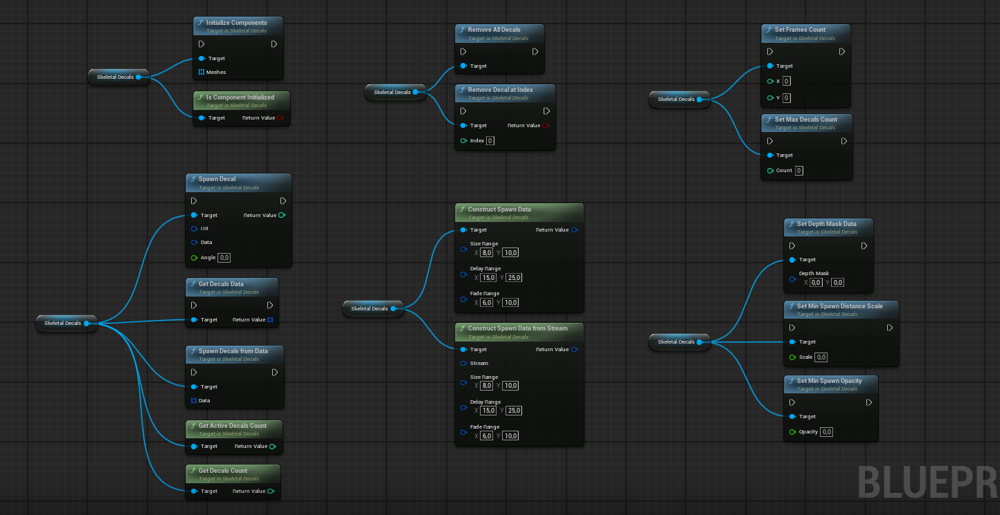
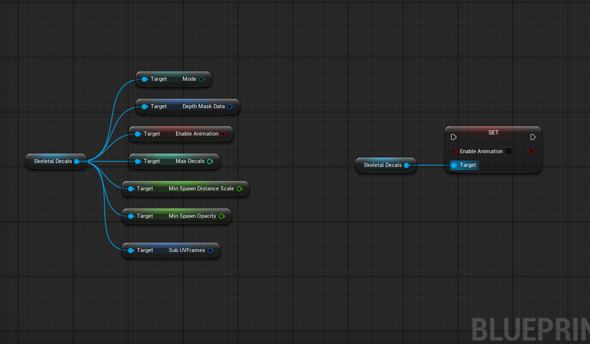
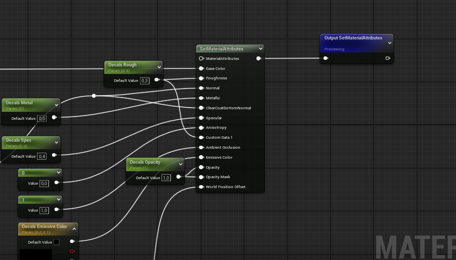
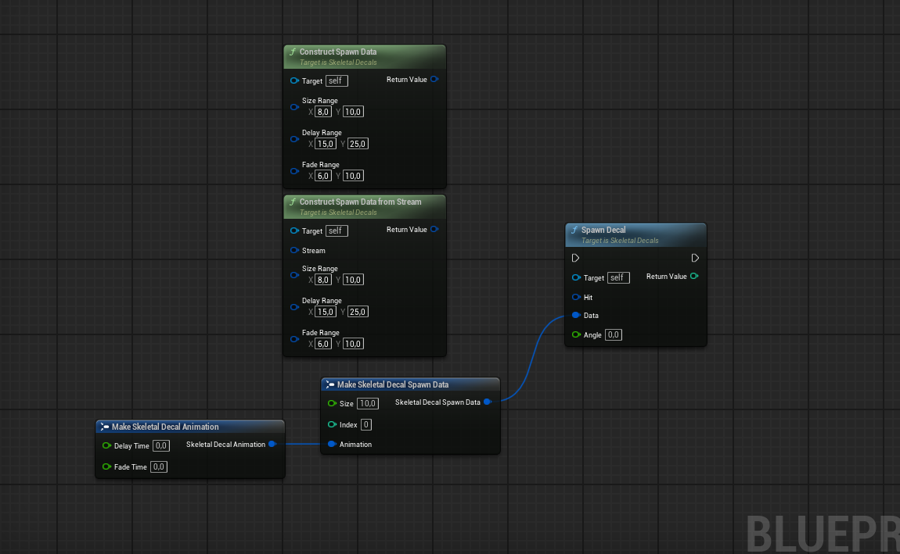
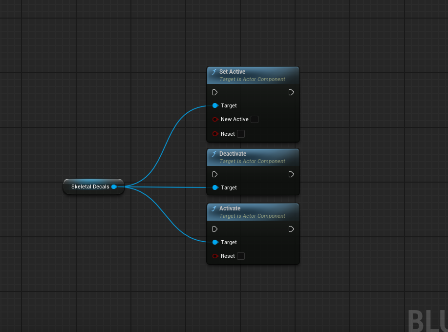
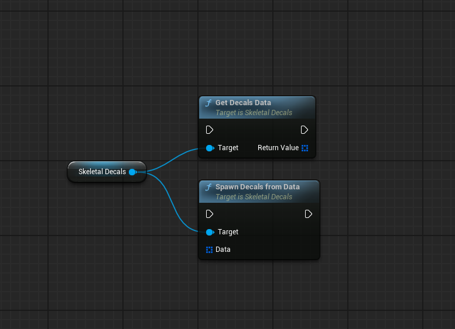

The Skeletal Decals component is an actor component that can be added to any actor, either at runtime or in the editor. To function correctly, it requires a Skeletal Mesh Component and Dynamic Material Instances.
The component is set to auto-activate by default.


If you have any questions regarding materials, require a different HLSL setup, have found bugs, or have suggestions for the Blueprint API, feel free to reach out at [📩 Email](mailto:lightstefar@gmail.com).


The following is a list of the component's available functions and variables.

## Initialization

The `Initialize Components` function creates Dynamic Material Instances for every material (if they do not already exist) and sets up the render target lookup. The render target itself is a low-resolution texture; its final size is calculated as **X = Max Decals** and **Y = Active Skeletal Decal Mode**. 


When the maximum decal count is reached, the system searches for an empty slot with opacity near 0. If no empty slot is found, it cycles back to the first entry and overwrites the oldest decal. Make sure to configure the required number of decals for your needs.


Some functions can only be used either before or after initialization is complete.

### Pre-Initialization Functions

| Function | Description |
|:--|:--|
| **Set Max Decals Count** | Sets the maximum number of decals allowed. This overcomes the default 256 decal limit but is still clamped to a maximum of 1024 decals. |
| **Set Frames Count** | **Projection mode only**   Sets the frame count for the Sub-UV atlas. |

### Post-Initialization Functions

| Function | Description |
|:--|:--|
| **Set Depth Mask Data** | Sets the depth mask values. **X** controls the offset (sharpness), and **Y** controls the intensity. |

---

## Material System

Under the hood, the Skeletal Decals Material Function is a modular system supporting both desktop and mobile renderers. The core HLSL logic handles render target lookups performing only the necessary mathematical operations.

To minimize samples per decal, the shader does not sample any additional packed textures (e.g., Metalness, Roughness, Specular). If you need to incorporate extra data, feel free to reach out—I can provide examples or help with custom HLSL.

Every decal, even if not visible, requires at least one texture lookup. Invisible decals are still processed by the system. Each mode has different processing requirements:

1.  **Projection Mode:** 5 texture lookups per decal, plus projection math and normal correction.
2.  **Sphere Mode:** 2 texture lookups per decal and 2 sphere masks.

An optimization is built-in: if a decal's opacity is zero or near-zero, the shader branches to skip 4 texture lookups (in Projection mode) or 1 texture lookup (in Sphere mode). The shader generally avoids branches and prefers cheap mathematical operations where possible, using branching only when it saves expensive texture lookups.

The material function is split into logical, modular building blocks. Several parameters are exposed in the material instance.




If you wish to override the default appearance of the material layer, it is recommended to copy or directly edit the logic inside the `MF_SkeletalDecals_Shading` function. The image below shows an example of a custom material layer.



---

## Spawn Functions

**Spawn Decal**

Checks which primitive component was hit and verifies if it is initialized in the Skeletal Decals Component. 
  The function can be constructed using helper functions or implemented manually when specific data needs to be passed.
 
**Returns:** The actual index of the active decal, which may be newly added or recycled. Returns `-1` if the decal could not be spawned for any reason.


**Note**: The Angle parameter is only valid in Projection mode and will be ignored in Sphere mode.


The following functions can be used to control spawn behavior:

| Function | Description |
|:--|:--|
| **Set Min Spawn Distance Scale** | Sets the minimum distance scale for a decal to spawn. Value is clamped to a range of `0-4`. |
| **Set Min Spawn Opacity** | Updates the minimum opacity threshold required for a new decal to spawn. |
| **Construct Spawn Data** | Helper function to construct decal data with randomized values. It calculates DelayTime, FadeTime, Size, and the sub-UV decal index based on Sub UV frames variable. |
| **Construct Spawn Data From Stream** | Same as the Construct Spawn Data function, but utilizes a specified random stream parameter. |

---

## Removal Functions

| Function | Description |
|:--|:--|
| **Remove All Decals** | Deletes all decals from the component. (Clear render target) |
| **Remove Decal at Index** | Sets a specific decal's opacity to 0, freeing its slot for a new decal. **Returns:** Boolean indicating success.|

---

## Animation System

This component features a user-controlled animation system similar to Unreal's native decals. Animation is calculated during the `TickComponent` event and uses Delta Time. Performance can be fine-tuned for specific project needs by adjusting the `Tick Interval` parameter. 


**Performance**  
`TickComponent` automatically disables itself once all animated decals have faded out and re-enables itself as soon as a new animated decal is spawned.


The system consists of a **Delay Time** and a **Fade Time**. Each decal stores its own animation parameters.
- **Delay Time:** The amount of time before the fade begins. This can be set to zero.
- **Fade Time:** The duration of the fade-out effect.

The `Enable Animation` boolean toggles the animation system on or off. When disabled, the system is frozen, and new decals are not added to the animation queue.


To make a decal static or infinite (and still utilize the animation system), set both its `Fade Time` and `Delay Time` to 0. This ensures the decal is not processed or removed by the animation system.


### Pausing and Resuming Animation

You can use Unreal's standard `Set Active`, `Activate`, and `Deactivate` functions to pause or resume decal animation when the system is enabled.

---

## Data Query Functions

| Function | Description |
|:--|:--|
| **Get Active Decals Count** | Returns the number of currently active/visible decals. |
| **Get Decals Count** | Returns the total number of decals in use, including those with an opacity of 0 (invisible). |

---

## Save, Load, and Copy Systems

These functions allow you to save, load, or reconstruct all decals from a save game, or copy decal data from different actors.

- **For C++ Developers:** The `Decals` or `Decals Data` property is marked as `SaveGame`, allowing the component to be easily serialized using Unreal's built-in serialization.
- **For Blueprint Developers:**

- **Get Decal Data:** Outputs all decal data, which can be saved in a save game slot.
- **Spawn Decals from Data:** Removes all existing decals, resets the component to its default state, and then spawns new decals from the provided data.

