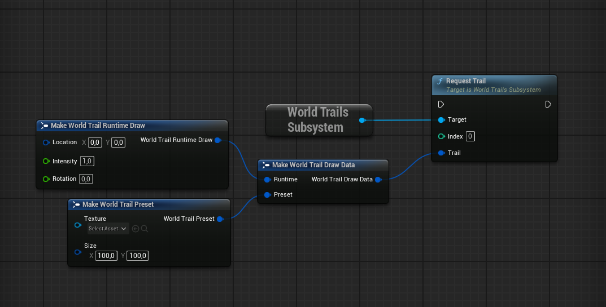
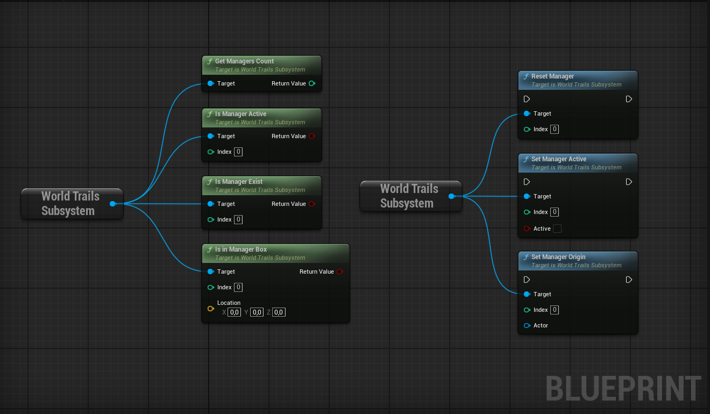
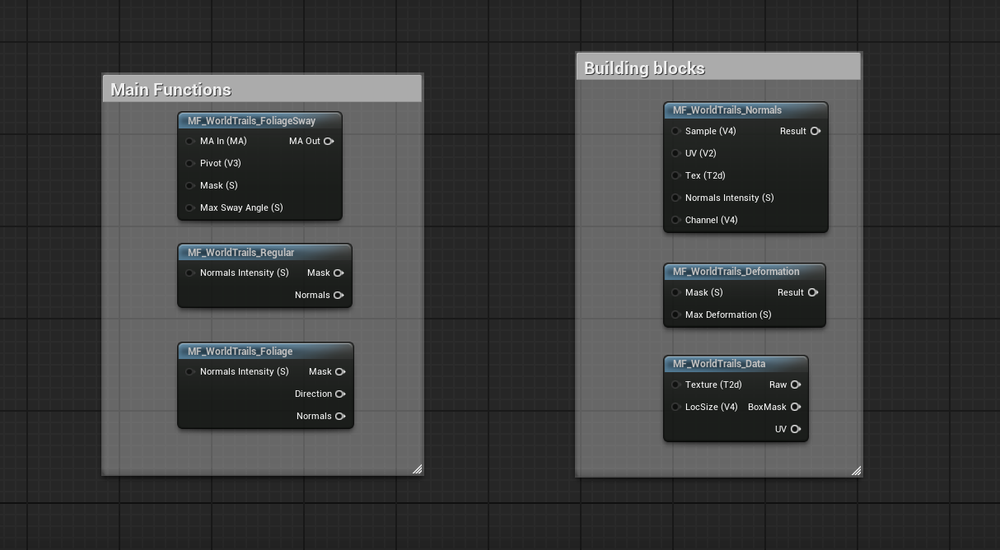
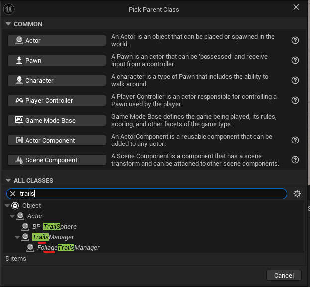
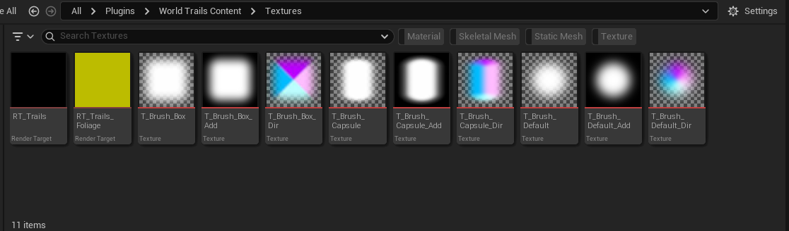

## Trail Manager

The Trail Manager is based on an Actor class and serves as a drawing board for Trail Components. It tracks the transform and lifecycle of an origin actor (if present). The root component of the actor is a simple Box Component, which determines the size of the trail world and can be freely scaled in the `Editor`. Every Trail Component operates within this box. 

Multiple managers can exist in a level, and each can be paused or reset during gameplay.

`Foliage Trail Manager` is a simple wrapper class of Trail Manager that overrides default values for an instant foliage trail setup.

---

A **Render Target** and **Material Collection** are required to draw trails.


The render target format must be at least `16-bit` for the fading system to work correctly. If you only need persistent trails, you can lower the format to `8-bit` to reduce runtime GPU memory usage.


The actor can draw trails in two different modes:

- **Translucent:** *(default)* All texture channels are clamped to 1. Masking is done with the help of the Alpha channel of the brush texture.
- **Additive:** Channels are unclamped and draw the brush texture as is. The maximum range of each channel depends on the render target format.

---

#### Manager Modes

The manager operates in two modes, changeable at runtime:

1. **Static Mode:** Uses its own origin location. Does not create an additional render target to handle origin actor movement. Ideal for static or small levels.

2. **Dynamic Mode:** Uses the origin actor's location, tracks `OnTransformMove()`, and auto-manages origin actor destruction or disabling. Creates an additional render target to dynamically shift the original, enabling continuous trails.


The origin actor can be set to `nullptr` at runtime. The copy render target will then be auto-removed from the manager.


---

#### Resolution & Performance Trade-offs

The default Trail Manager resolution is a trade-off between visual quality and world size. For character footprints or small, precise brush shapes, increase the **Render Target Scale**. Keep in mind that higher resolution uses more GPU memory and may result in slower updates. In such cases, the world box size should be reduced.

Performance stats from the Example Project (Render thread, captured via Unreal Insights) are shown below. The RHI thread shows similar results.



---

#### Multiplayer & PIE Limitation

Networking works out of the box for each Trail Manager, as long as dynamic trail origin is not required. However, there is a known limitation when testing multiplayer in **Play-In-Editor (PIE)** due to global render target sharing.

In PIE mode, each client reuses the same global render target assigned in the Editor because of shared memory. As a result, all clients draw into the same render target texture, causing trails to appear incorrect or messy.


Always test multiplayer trails in Standalone mode.


---

| Variable | Default | Description |
|:--|:--|:--|
| **Manager Index** | 0 | Simple unique index per Trail Manager actor. Required to function with multiple managers in a level. |
| **Render Target Scale** | 1.0 | Scales the final resolution of the render target. |
| **Additive Blend** | false | Switches between Translucent and Additive blend modes to draw trails. |
| **Fade Trails** | false | Enables fading of trails over time. |
| **Fade Duration** | 15.0 | Duration in seconds for trails to fade completely. |
| **Material Collection** | MPC_Trails | Material collection parameter. Customizable, useful for custom trails or when working around Unreal's limit of maximum 2 MPCs per material. |
| **Collection Loc Size Name** | LocSizeDefault | Vector parameter that the manager will update (if needed). Consists of Location (Vector2D) and Size (Vector2D). The name must be correct for trails to work. |
| **Brush Texture** | T_Brush_Default | *Advanced* Default brush texture used if the trail's brush texture is not overridden. |
| **Stay on Last Known Position** | true | For a dynamic manager setup. If the manager's origin actor is explicitly disabled or destroyed, the manager will fall back to the last known position of the origin actor or to the manager's original position in the level. |

---

## Trail Component

The Trail Component is a simple, handy wrapper around the `Request Trail` function. It can detect the underlying surface and surface type with the help of a Line Trace, then push data to the Trail Manager through the subsystem.


The Line Trace ignores the rotation of the actor and always traces in the negative Z direction. Trail intensity is calculated from the distance of the trace hit and the base intensity variable.


| Variable | Default | Description |
|:--|:--|:--|
| **Manager Index** | 0 | Simple unique index per Trail Manager actor. Required to function with multiple managers in a level. |
| **Preset** | None | Overridable brush texture. Can be left as `None`; the default manager brush will be used. |
| **Size** | (100.0, 100.0) | Width and height size of the trail. |
| **Base Intensity** | 1.0 | Intensity multiplier for the final trail intensity. Useful for additive trails. |
| **World Rotation** | None | If true, uses the world space YAW angle of the component; if false, uses relative rotation. |
| **Trace Distance** | 10.0 | Maximum distance to trace. Can be set to `0` to disable the line trace completely and always draw a trail. |
| **Trace Offset** | 0.0 | Offset from the start position on the negative Z axis. |
| **Trace Channel** | Visibility | Collision channel to trace against. |
| **Excluded Surfaces** | Empty | List of surface types that will be excluded from requesting a trail. |


You can calculate and push data manually without using the Trail Component if needed. Simply call `Request Trail` in the World Trails Subsystem.



---

## World Trails Subsystem

The Subsystem is a handy bridge between Trail Components (or custom actors/components) and Trail Managers. Almost all of the functions inside the subsystem are exposed in Blueprint. Below is the list of all functions.

**`Set Manager Origin`** can accept `nullptr` as an actor, which will remove the tracked origin actor. Depending on the settings of the manager actor, this will result in the manager's origin staying at the last known position or resetting to its original location in the level. This is also the main function for correct replication. You can find usage examples in the Example Content or in the `BP_TrailsOrigin` actor inside the demo content.

**`Set Manager Active`** can temporarily and completely freeze the process of drawing new trails. Drawing can be resumed at any time, which can be useful in certain circumstances.

**`Reset Manager`** will clean up the render target, removing all active and requested trails when the function is called.

---

## Material Functions

Material functions serve as building blocks. They are fairly simple if you have some knowledge of creating materials. `MF_WorldTrails_Data` is the main block to retrieve custom data if you need to set up a custom material.

---

## Custom Trail Manager

You can extend the Trail Manager class to create your own setup with custom brushes and parameters.

To create your custom Trail Manager, follow the steps below:

{}

#### Create a Blueprint Class
Right-click in the **Content Browser** and select **Blueprint Class**.

#### Choose the Native Powerline Class
In the **Pick Parent Class** window, type `trails` in the search bar. Select the **TrailsManager**  or **FoliageTrailsManager** class as shown below, then click **Select**. Enter a name for your new custom actor.

#### Configure Default Values
Open your new Blueprint and customize its properties to fit your project's needs.

{}

---

### Custom Brushes and channels

The render target can use up to 3 channels (RGB) in Translucent mode. The Alpha channel is reserved for blending and fade.

- **Translucent Mode:** Each channel is multiplied by the Alpha channel of the brush texture. You will need to put non-multiplied values into the RGB channels and apply the mask to Alpha.
- **Additive Mode:** Each channel is drawn as is, so every channel should be pre-multiplied with a mask if necessary.

The default brush textures for foliage are created with the help of `SDF` shapes.

