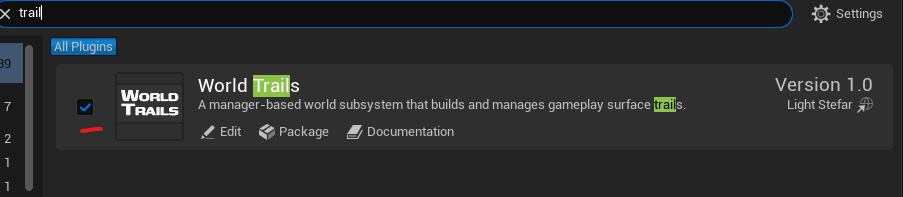
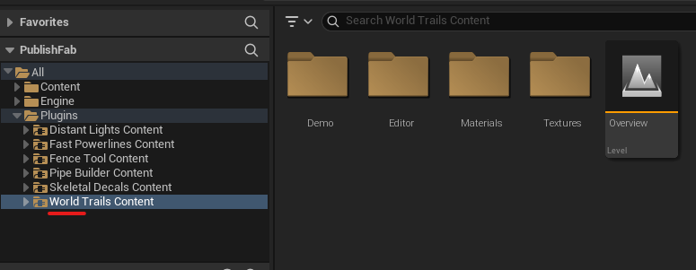
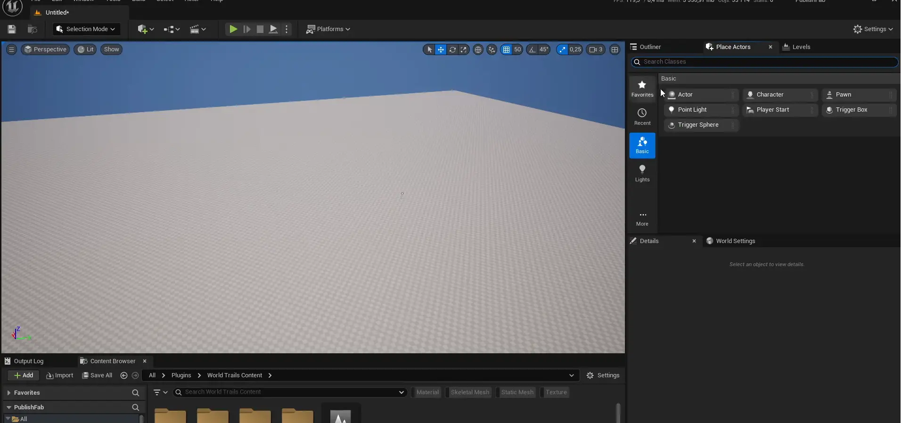
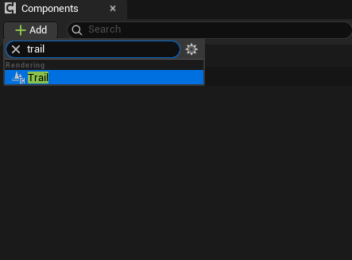
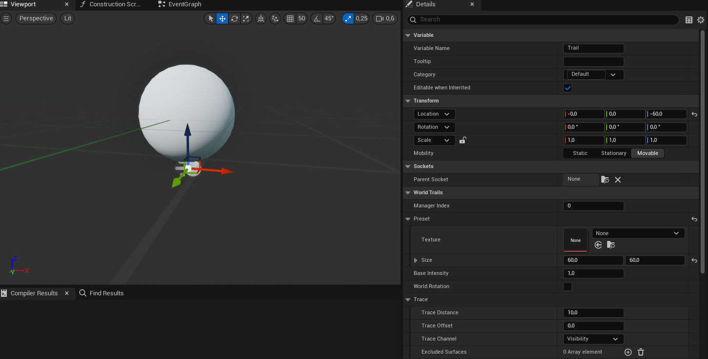
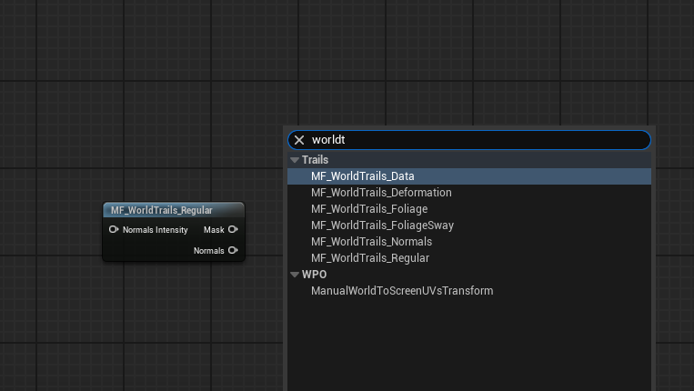
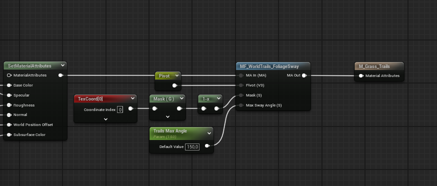
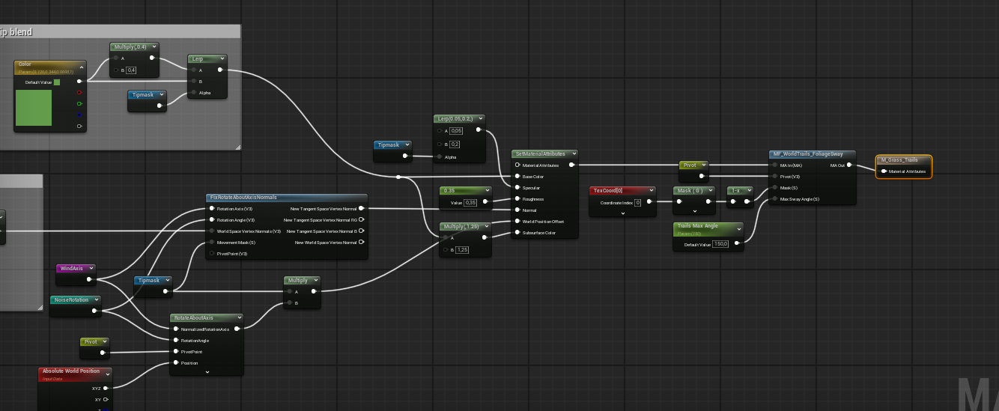

A quick guide to get started with the Powerlines plugin.

## Installing the Plugin

{}

####  Download
Download the plugin from the **Fab** tab in the Epic Games Launcher.

#### Install
Click **Install to engine** and select your installed Unreal Engine version.

#### Open Plugins Window
Open your project, go to **Edit → Plugins**, and find the Fast Powerlines plugin window.


Type `trail` in search bar.


#### Enable the Plugin
Enable the plugin by checking its box as shown below.

{}

## Quickstart

{}

#### Navigate to the Plugin Folder
Open the **Content Browser** and navigate to the **World Trails** plugin folder.


If the plugin folder is not visible, ensure **Show Plugin Content** is enabled. Click the **Settings** button in the top-right corner of the Content Browser and check this option.



#### Add a Trails Manager to Your Level
Type `trails` into the **Place Actors** search bar and drag the actor from there into your level.

#### Add a Trail Component to Your Actor/Character
Open your preferred actor Blueprint and click the **Add** component button at the top-left. Type `trail` in the search bar and select **Trail Component**.

#### Optionally Modify Transform or Parameters
Adjust the transform or change default parameters in the Trail Component. The example below simply offsets the location on the Z axis.

#### Change the Surface Material
Use the built-in example material for a fast trail preview. Navigate to the **Demo** folder inside the plugin folder, drag and drop the `M_TrailPreview` material into the mesh surface slot, and press **Simulate** to test the result.



{}

---

### Foliage Trails

Follow the same steps as above, but with the following changes:

- Replace **Trails Manager** with **Foliage Trails Manager**
- Replace `M_TrailPreview` with `M_TrailPreview_Dir`
- Add a material function to your foliage material (see below)

#### Add Material Function

Open your foliage material and right-click in the graph. Type `worldtrails` in the search bar.

Select **MF_WorldTrails_FoliageSway** and add it to the material graph as shown below.


If your material doesn't have the same pins as shown above, you need to enable **Material Attributes**. To do this, check **Use Material Attributes** in the Details panel.

Then update your material setup to support material attributes, as shown below.



